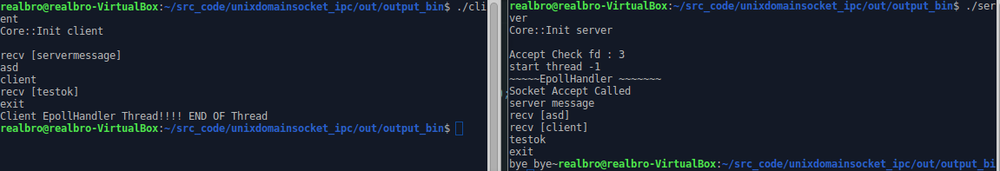
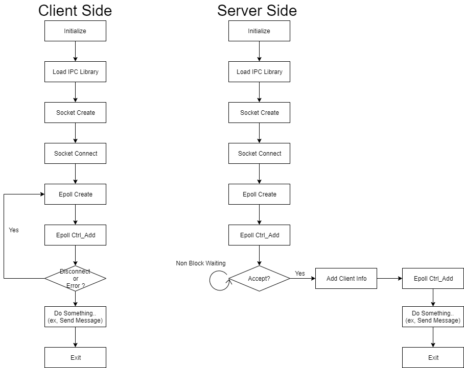

# UnixDomainSocket IPC

## 개요 
- 간단한 ipc가 필요한 상황에서 급하게 제작함 . (5byte 송수신할 필요가 생김)
- 동적으로 물어다 쓰기위해 외부 노출 인터페이스를 만들었는데 (Export.cpp) 테스트는 헤더로
- Epoll Handler 내부에 지저분한 코드가 있는데, Server,Client 한쪽이 죽어도 재접속을 시도하기 위해서 그러한 구조가 되었다..... Asio가 최고 ~  
- Impl / Pimpl 형태로 만들려다가 구지 그럴필요가 없어서 안했더니 메소드 추가가 어려운 구조가 됬다 (메소드 1개 추가시 class 3개 수정 필요)

## env
- Unix 환경에서 사용가능한 IPC (c++ 사용한건 하위버전 부스트로 때울수 있음.)
- clion
- c++ 11/14
- google case + Camel + Pascal .... 

## 기타 
- Asio가 최고다.
- 급하게 짜느라 코드가 엉망.

## 사용.
Header -> UnixDomainSocketCore.h
1. Initialze(콜백 포인터 /*리스브용 */, bool /*server or client )  
2. SendMessage (데이타~)

## 간단 흐름 

